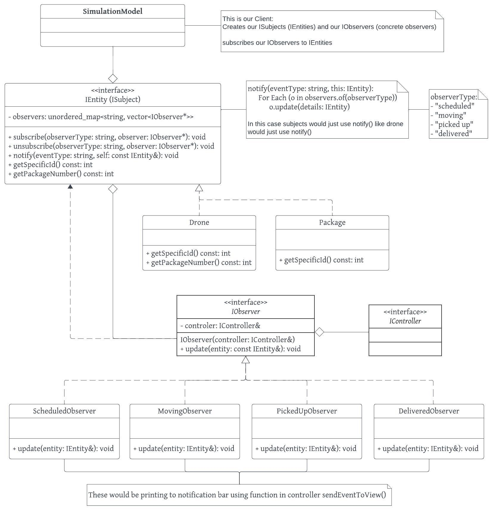

# README

- File Name: `README.md` (should be located in the GitHub repository)

# Notification Bar:

### Team: team-010-17

- Team number, member names, and x500.

Maria Zavala - `Zaval054`

Nikki Yu - 'yu000664'

## Overview:

- What is the project about (overview of the whole project, not just the hw4)?

### Running Project:

- How to run the simulation (overview of the whole project, not just the hw4)?

### [individual features]:

- What does the simulation do specifically (individual features i.e. movement of entities etc) (overview of the whole project, not just the hw4)?

## Extension:

### UML: not final still working

### Whats happening:

1. Out Client creates a publisher and subscribers that are subscribed to specific publishers:
    1. Create `IEntity`: specific type
    2. Create `IObserver`: specific type
    3. `IEntity`: NType.Subscribe(IObserver: NType)
2. `IEntity` has a list of subscribers/observers, so that when a change occurs in `IEntity` it can notify them.
    1. Each type of `IEntity` can subscribe and unsubscribe specific `IObservers`.
    2. Each type of `IEntiy` can notify its `IObserver` if It has made a specific type of change:
        - `notify("pickedup", this)` -> this is the current `IEntity`.
3. Our `IObservers` can choose to specifically subscribe to a specific kind of `IEntity`.
    - RobotObserver -> Robot
4. `IObserver` has a `update()` function that accepts a `IEntity`?
    1. Then uses the `JsonObject` details or `IEntity` functions like `getName()`, `getDetails()` or `getId()`.
    2. This would then set these details to a JsonObject with specific parameters
    3. Then within `Update()` would use `sendEventToView()` function that sends a command such as
        - `sendEventToView("Notification", details: JsonObject)`
5. Within `main.js`:
    1. It receives `"Notification"` and matches to specific `if` and calls our `notification()` Function that displays to notification bas similar to `displayJSON()` function in `main.js`

- Drone picked up a package, Now DroneObserver will update its JsonDetails to send a `"notification" -> "pickedup"` would probably also get the current drones details like	`getDetails(): JsonObject` or `getName()` or `getId()`

### New Feature:

- What does it do?
- Why is it significantly interesting?
- How does it add to the existing work?
- Which design pattern did you choose to implement it and why?
- Instruction to use this new feature (if the new feature is not user interactable, please mention this as well)
- Sprint **retrospective**

### Docker:

- Docker Link (be sure to state what the link is about).

### Video:

- VIDEO: upload this video to YouTube and put the link that will redirect toward your video inside the README (be sure to state what the link is about).

### Presentation:

- If you create a PowerPoint (or presentation material) for your Youtube Presentation Video, please include these with your submission as a PDF in your GitHub repository.
