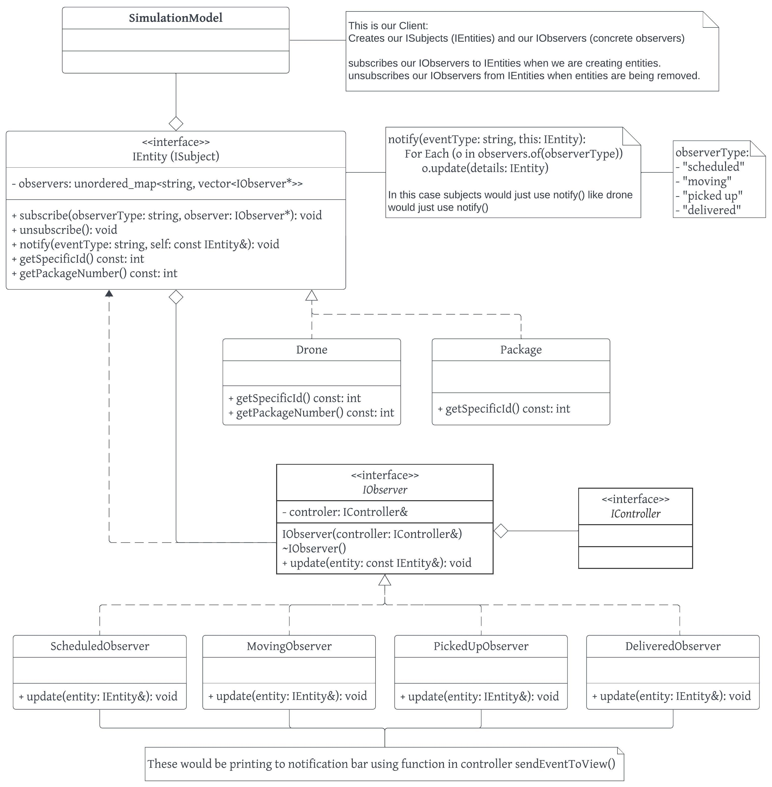

# README

## Notification Bar:

### Team: team-010-17

> - Maria Zavala - `Zaval054`
> - Nikki Yu - `yu000664`
>

## Overview:

This project is a drone simulation with a web interface. Users have the capability to schedule package deliveries by specifying two locations on a map. During scheduling, they input a name representing the package and the respective customer. Additionally, users can choose a pathfinding algorithm for the drone from a dropdown menu.  Subsequently, the drone executes the scheduled task, picking up the specified package and delivering it to the designated customer. The simulation also includes a 3D-rendered map, visually illustrating the drone's movements, the location of the robot symbolizing the customer, and a visual representation of the package in the form of a box.

## Running Project:

> There are two methods to run the project: 
> - For the easiest setup, utilizize Docker to ensure seamless execution. 
> - Otherwise clone the project from GitHub.

### Docker:

Visit our [Docker Hub Repository](https://hub.docker.com/r/pazzavala/drone_sim) to access official Docker images for our application. Docker Hub serves as a centralized platform for sharing, distributing, and managing Docker container images. You can find different versions of our application, along with detailed documentation and usage instructions on our Docker Hub page.

###### Executing the provided Docker command initiates the drone simulation:

```bash
docker run --rm -it -p 8081:8081 pazzavala/drone_sim:latest
```

###### To interact with the running drone simulation:

1. Access the simulation interface at http://localhost:8081
2. Access the scheduling interface at http://localhost:8081/schedule.html

###### To conclude the simulation:

- Click the "Stop Simulation" button within the drone simulation interface.

Alternatively, use the following Docker command to stop the simulation by killing the container:

```bash
docker kill <containerID>
```

------

### GitHub:

1. Clone the project from GitHub.
2. Ensure that port `8081` is available and forwarded.
3. Navigate to the project directory.
4. Execute the command: `make -j`
5. Run the project with the command: `make run`

###### To interact with the running drone simulation:

1. Access the simulation interface at http://localhost:8081
2. Access the scheduling interface at http://localhost:8081/schedule.html

###### To conclude the simulation:

1. Click the "Stop Simulation" button within the drone simulation interface.

## Individual Features:

#### Scheduling:

> Users engage in the scheduling process by selecting specific locations on a map and including the package name and the choice of pathfinding algorithm that the drone will use. This ensures a customized delivery to the user's preferences and needs.
>

#### Entity Creation:

> Entities such as drones, packages, and robots are not just statically predefined; instead, they are dynamically created and efficiently managed within the system. Utilizing the Factory pattern enables adaptable and scalable instantiation of entities, allowing for easy creation of new entity types, for example such as a car, to meet evolving simulation requirements.
>

#### Movement:

> The simulation incorporates the movement of entities, providing a visual representation on a 3D-rendered map. The movement strategy is customizable using the Strategy pattern, allowing users to choose from pathfinding algorithms such as A-star, BFS, DFS, and Dijkstra. This design choice enhances flexibility and maintainability, as users can easily swap or extend pathfinding algorithms without modifying the core logic of the application. This modular approach simplifies future updates and accommodates diverse user preferences in pathfinding strategies.
>

#### Celebration:

> Utilizing the Decorator pattern, each drone is decorated based on the chosen pathfinding algorithm. Celebratory actions occur upon successful package delivery, with specific each specific decoration corresponding to the selected algorithm:
>
> - A-star drones use a celebratory jump decorator.
> - BFS drones start with a spin followed by a spin decorator.
> - DFS drones start with a spin followed by a jump decorator.
> - Dijkstra drones start with a jump followed by a spin decorator.
>
> The Decorator pattern facilitates the addition of celebratory actions upon successful package delivery, offering a modular approach to enhance drones' behavior. By encapsulating the celebratory actions within decorators, we achieve a clear separation of concerns, making it easy to introduce new algorithms or modify existing ones. This modularity promotes maintainability, scalability, and code reusability, providing a streamlined way to augment drone behavior with specific and customizable celebratory actions for each pathfinding algorithm.

#### Notification Bar:

> The notification system plays a vital role in the simulation, providing real-time updates on key events. Utilizing the Observer pattern, this functionality separates the notification logic, enhancing both maintainability and extensibility. Leveraging the flexibility of the Observer pattern enables the system to inform diverse observers (subscribers) about simulation changes, including package pickups, deliveries, or other notable events. This design decision guarantees the adaptability of the notification system to future alterations in the simulation's dynamics.

#### Simulation Model:

###### (Tying it all together)

> The `SimulationModel` component serves as the core coordinator of the simulation, managing the creation, scheduling, and updating of entities within the system. It interacts with various factories for dynamic entity creation, including drones, packages, robots, humans, and helicopters. The simulation model incorporates a graph structure to represent the spatial map and the paths available to for the drone to use as a route.
>
> The `SimulationModel` is responsible for scheduling deliveries, initiating trips based on user-defined details, and updating the simulation over time. It utilizes observer patterns to notify specific observers, such as the `ScheduledObserver`, `MovingObserver`, `PickedUpObserver`, and `DeliveredObserver`, about relevant events in the simulation. Additionally, it handles the removal of entities and dynamically allocated variables.
>
> The flexibility of the `SimulationModel` enhances adaptability to changes in the simulation's dynamics, allowing for the addition of new entity types and seamless updates to the simulation logic. This central component encapsulates critical functionalities, contributing to the modularity and maintainability of the overall simulation system.

## Extension:

### Decorator UML Diagram:



##### What's Happening In UML:

1. The client creates publishers and subscribers.
2. `IEntity` defines specific types and subscribes `IObserver` instances.
3. `IEntity` notifies its subscribers of changes.
4. `IObserver` implements the `update()` function to receive and process updates.
5. The system updates a notification bar with specific details.

## Notification Bar:

###### (New Feature)


#### What does it do?

> The new notification bar feature employs the observer pattern to provide real-time updates on significant events within the simulation. It tracks various entities, such as drones, using specialized observers like `ScheduledObserver`, `MovingObserver`, `PickedUpObserver`, and `DeliveredObserver`. These observers trigger notifications in the bar, enhancing the user's awareness of critical simulation activities. 

#### Why is it significantly interesting?

> This extension is intriguing because it offers a visually interpretable representation of the simulation's current activities through readable text. The notification bar significantly enhances the user experience by delivering real-time updates on crucial simulation events. This feature not only keeps users informed but also contributes to better situational awareness during the simulation.

#### How does it add to the existing work?

> By presenting immediate information about important events like package pickups and deliveries, the notification bar contributes to a more informative and engaging user interface. This capability becomes particularly valuable when multiple drone deliveries are concurrently underway. It streamlines the visual representation of ongoing events in the simulation, eliminating the need to navigate through the map to individually track each drone and package movement.

#### Which design pattern did you choose to implement it and why?

> The implementation relies on the observer pattern, giving efficient communication by decoupling observers from subjects. This choice ensures flexibility and maintainability, particularly evident in the notification bar's observation of every new drone. This design allows seamless scalability to include other entity types, making the notification logic adaptable to diverse simulation scenarios. The observer pattern's decoupling enables the notification bar to flexibly handle different situations without requiring significant modifications. Extending the types of observations is straightforward, given the current observers like `ScheduledObserver`, `MovingObserver`, `PickedUpObserver`, and `DeliveredObserver`. Adding new observers, such as for Robots or other entities, can be seamlessly implemented. This flexibility ensures that the notification bar remains easily extensible as the simulation evolves.

#### Instruction to use this new feature:

> The notification bar updates automatically as events occur in the simulation. Users can observe relevant notifications in real-time. The subjects and observers are automatically generated as new entities are created by the simulation model, eliminating the need for direct user interaction with this feature directly.
>

## Sprint Retrospective

We did two sprints, each about a week and a half. The first sprint was intended to get us to the point where we had a functional project. The second sprint was dedicated to testing and finishing up other tasks, such as the readme and the video presentation.

#### Sprint 1: 11/21 – 12/01

This sprint went pretty smoothly. We met twice, once at the beginning and once near the end to check in and see how things were going. We managed to complete the coding parts of the extension by the end of this sprint, which was the goal. One thing that could have made the process better would have been finding more time to work on the project at the same time. Nothing seemed disjoint because we communicated pretty well through the process, but in a larger setting or for a larger project, doing everything asynchronously could have added difficulty.

#### Sprint 2: 12/02 – 12/14

This sprint also went well. We met at the beginning of the sprint and were in communication through other means throughout it. Since the extension was essentially done by this point, this sprint was more about checking off the last few items that needed to be completed.

Overall, the project timeline and process went well. We had our extension outlined before we started implementing it and we stayed in communication throughout the sprints.

## Video:
Visit our [YouTube Video](https://youtu.be/IJQHJSHHxKQ) where we provide an overview of our extension, demonstrate our drone simulation, and discuss aspects of our notification system source code.
