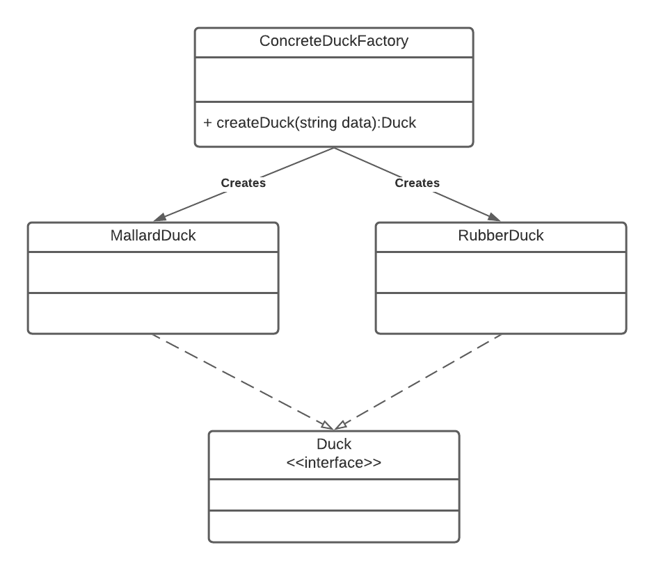
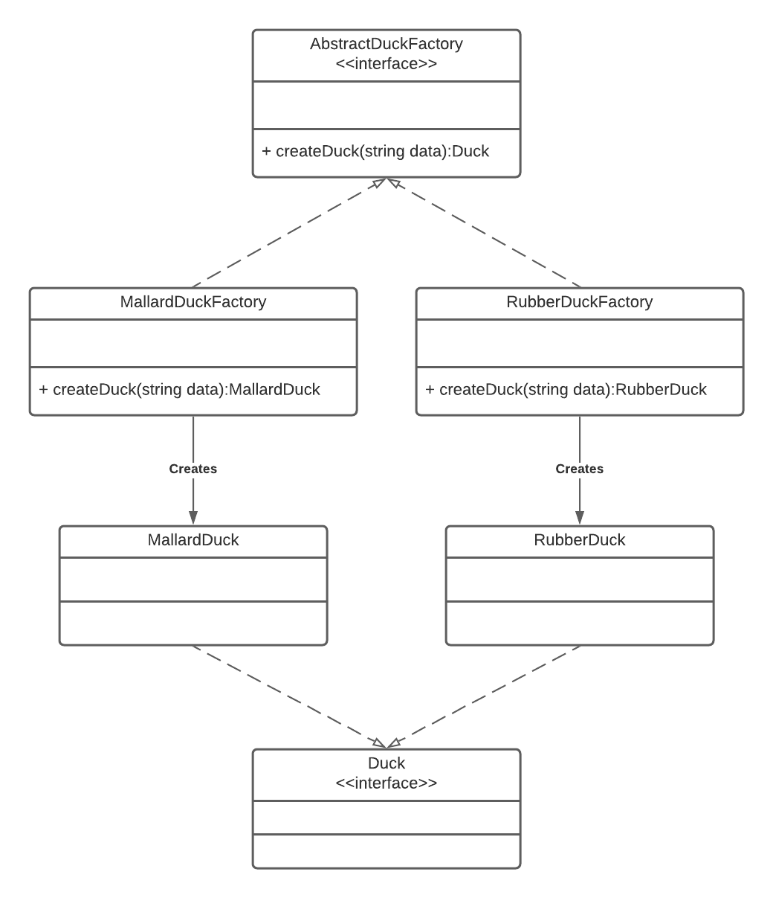
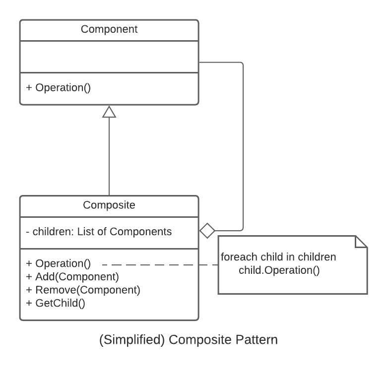

# 3081 Lab 7: Composite Factory Design Pattern
_(Due: Thursday, October. 26th, 2023 @ 11:59pm)_

## General Information

### Accessing a Lab Machine
For this assignment, we suggest you use a lab machine in ***Keller Hall 1-250*** or ***Keller Hall 1-262*** ([details](https://cse.umn.edu/cseit/classrooms-labs#cselabs)), as Git is already installed on these machines. You can also access a lab machine remotely using [SSH](https://github.umn.edu/umn-csci-3081-f23/FAQ/blob/main/SSH/README.md) or a web-based service called [VOLE](https://github.umn.edu/umn-csci-3081-f23/FAQ/blob/main/VOLE/README.md). You will use your CSE Labs account to login to the lab machines. If you do not already have an account, create the account following these [instructions](https://wwws.cs.umn.edu/account-management).

**IMPORTANT: One of the reasons you might not be able to log into a lab machine is that you reached your CSE Labs Account disk quota. To free space, please use these [instructions](https://github.umn.edu/umn-csci-3081-f23/FAQ/blob/main/CSE%20Disk%20Quota%20Exceeds/README.md). (In some cases, you might need to SSH into a CSE classroom or lab machine to complete the instructions.)**

## Retrieve Class Materials
1.  Clone your teams **private Lab07** repository<br>
    *Note: **replace** Team-XXX-X with your lecture section and team number* <br>
    *Example: Team-001-1-lab07*
    ```bash
    git clone git@github.umn.edu:umn-csci-3081-f23/Team-XXX-X-lab07.git
    ```


### What's in lab07 folder?

<ul>
  <li>  <code>README.md</code>
  <li>  <code>.gitignore</code>
  <li>  <code>app</code> folder, which contains:
    <ul>
      <li>  <code>graph_viewer</code> : producing graph visualization
      <li>  <code>transit_service</code> : visualization
    </ul>
  <li>  <code>libs</code> folder, which contains:
    <ul>
      <li>  <code>routing</code> : finding the paths
      <li>  <code>transit</code> : entities properties
    </ul>
  <li> <code>docs</code>: Doxygen documentation files
  <li> <code>dependencies</code>
</ul>

## Lab Instructions

### Goal
<hr>
  The primary goal of this lab is for you to implement the factory design pattern, then create a composite factory using the component factories that you have just created.
<hr>

## Tasks
| ID | Title | Task Summary Description | Task Deliverable |
| :---: | --- | --- | --- |
| Task 1 | Composite Factory Design Pattern | Implement the composite factory design pattern into the source code to create the entities | Source Code |
| Task 2 | Doxygen | Create documentation of the classes/functions that you create | HTML/Source Code |
| Task 3 | Code Styling | Match your code style with Google style guidelines | Source Code |

## Task 1 (Composite Factory Design Pattern)
### Concepts
### The Factory Pattern

The factory pattern defines an interface for creating an object, but lets the subclasses decide which class to instantiate. Factory method lets a class defer instantiation to subclasses. Utilizing the factory pattern allows you, the developer, to enforce SOLID principles.

There are two types of factories that you can create: An abstract factory or a concrete factory. 

#### Generic Concrete Factory UML

Below is the UML to create concrete factories. This pattern should be used when the number of types of items to generate will rarely change in your software. For example, in our simulation if we were only going to generate drones, packages, and customers(robots) then the concrete factory should be used. Since we are not limiting ourselves just to these entities and want to stay **Open to extensions**, the concrete factory should not be used.<br><br>
Example:
<p align="center"></p>
<br>

#### Generic Abstract Factory UML

Below is the UML to create an abstract factory. This pattern should be used when you want to push the creation of objects into the subclasses. Adding an intermediary class between the factory and your program allows you to utilize polymorphism as shown during lecture and also on the lecture slides.<br><br>
Example:

<p align="center">  </p>
<br>

### The Composite Pattern

The composite pattern allows us to treat a group of objects as a single object. Additionally, it allows us to organize those objects as a hierarchy. 

In the composite pattern Component objects will be added to a Composite object (which implements the Component interface).

This can be helpful when there are operations that we want to perform on a group of the same type of objects. We would only need to perform the operation on the composite object for the same result as performing that operation on all the composed Component objects. 
<br><br>
Example:

<p align="center">  </p>
<br>

More information on the composite pattern can be found here:
- [DoFactory.com](https://www.dofactory.com/net/composite-design-pattern)
- [Refactoring.guru](https://refactoring.guru/design-patterns/composite)

## Steps to complete Task 1
1. Implementing the Composite Factory

    For lab07, we want to create a composite factory which draws from both the composite and factory patterns. This means that we will have a composite factory which contains different component factories. 

    Based on the UML, we can see that we will need to be able to add the new types of factories to the Composite factory and then use those added factories to create the entities. 
    <p align="center">  </p>

    **IEntityFactory**: An interface factory class which all other factories will realize in order to be stored in a composite object.
    - \+`CreateEntity(JsonObject&): IEntity*` - This is the generic entity creation that should be overwritten in subsequent files. *Note: If this class is an interface, what should be done with this method's definition?*
    
    **CompositeFactory**: A Factory and Composite class which will be composed of `IEntityFactory` objects or pointers. The composite factory can use these factories to create an entity of the corresponding type.
    - \+`CreateEntity(JsonObject&): IEntity*` - Loops through its vector of factories and calls their CreateEntity( )
    - \+`AddFactory(IEntityFactory*): void` - Add the factory into componentFactories

    **PackageFactory**
    - \+`CreateEntity(JsonObject&): IEntity*` - Create Package entity if the type matches

    **DroneFactory**
    - \+`CreateEntity(JsonObject&): IEntity*` - Create Drone entity if the type matches

    **RobotFactory**
    - \+`CreateEntity(JsonObject&): IEntity*` - Create Robot entity if the type matches


2. Use this CompositeFactory to create entities inside the SimulationModel class.
3. For this lab, you will need to create...
    - IEntityFactory.h (Why might not you need a source file for this?)
    - CompositeFactory.h/.cc
    - PackageFactory.h/cc
    - DroneFactory.h/.cc
    - RobotFactory.h/.cc
  
  where they will live in `libs/transit/include` and `libs/transit/src` accordingly. 
4. Now integrate the CompositeFactory into the SimulationModel so that it can be use. Integrating into SimulationModel includes but not limited to:
    - Adding CompositeFactory attribute
    - Add necessary factories into the CompositeFactory attribute
    - Use the CompositeFactory to create the entities
    
5. If you have completed all of the steps above, compile the project code and run the program and see if it works. It is considered "working" if the Drone is generated at startup, and after scheduling a delivery, both the robot and package have been generated.

## Task 2 - [Doxygen](https://github.umn.edu/umn-csci-3081-f23/public-lab06)
Write Doxygen for all the NEW classes/functions you created. Which in our case for this lab, it will be as follow (unless you create more new classes/functions aside from the provided UML):
  - IEntityFactory
  - CompositeFactory
  - DroneFactory
  - RobotFactory
  - PackageFactory


## Task 3 - [Code Styling](https://github.umn.edu/umn-csci-3081-f23/public-lab05)
Match your new/modified code's style with Google Code Styling guide. Which in our case for this lab, it will be as follow:
  - IEntityFactory
  - CompositeFactory
  - DroneFactory
  - RobotFactory
  - PackageFactory
  - SimulationModel

## Final Submission
**One submission per group. Designate someone to make the submission, then add members to the submission!**

To submit your assignment, post on the Gradescope assignment "Lab 7: Factory Design Pattern" your team repo link and the final commit ID for your submission.
Click [here](https://github.umn.edu/umn-csci-3081-f23/FAQ/blob/main/Commit%20ID/README.md) to see how to get commit id.
