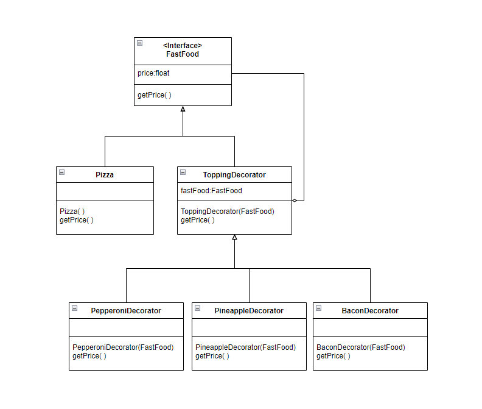
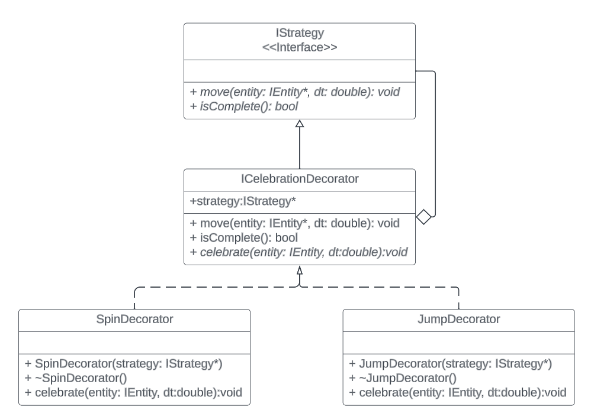

# 3081 Lab 9: Decorator Design Pattern
_(Due: Thursday, November 9th, 2023 @ 11:59pm)_

## General Information

### Accessing a Lab Machine
For this assignment, we suggest you use a lab machine in ***Keller Hall 1-250*** or ***Keller Hall 1-262*** ([details](https://cse.umn.edu/cseit/classrooms-labs#cselabs)), as Git is already installed on these machines. You can also access a lab machine remotely using [SSH](https://github.umn.edu/umn-csci-3081-f23/FAQ/blob/main/SSH/README.md) or a web-based service called [VOLE](https://github.umn.edu/umn-csci-3081-f23/FAQ/blob/main/VOLE/README.md). You will use your CSE Labs account to login to the lab machines. If you do not already have an account, create the account following these [instructions](https://wwws.cs.umn.edu/account-management).

**IMPORTANT: One of the reasons you might not be able to log into a lab machine is that you reached your CSE Labs Account disk quota. To free space, please use these [instructions](https://github.umn.edu/umn-csci-3081-f23/FAQ/blob/main/CSE%20Disk%20Quota%20Exceeds/README.md). (In some cases, you might need to SSH into a CSE classroom or lab machine to complete the instructions.)**

## Overwritten Unique Changes

All students are given the same base code for labs which are the solutions to the previous lab. If you had any personal changes or implementations in previous labs that you want carried forward to the current or future labs, those changes will need to be manually copied over by you, the developer.

## Retrieve Class Materials
1.  Clone your teams **private lab09** repository<br>
    *Note: **replace** Team-XXX-X with your lecture section and team number* <br>
    *Example: Team-001-1-lab09*
    ```bash
    git clone git@github.umn.edu:umn-csci-3081-f23/Team-XXX-X-lab09.git
    ```


### What's in lab09 folder?

<ul>
  <li>  <code>README.md</code>
  <li>  <code>.gitignore</code>
  <li>  <code>app</code> folder, which contains:
    <ul>
      <li>  <code>graph_viewer</code> : producing graph visualization
      <li>  <code>transit_service</code> : visualization
    </ul>
  <li>  <code>libs</code> folder, which contains:
    <ul>
      <li>  <code>routing</code> : finding the paths
      <li>  <code>transit</code> : entities properties
    </ul>
  <li> <code>docs</code>: Doxygen documentation files
  <li> <code>dependencies</code>
</ul>

## Lab Instructions

### Goal
  The primary goal of this lab is for you to implement the strategies' celebration decorator design pattern. Once the drones deliver their package to their destination, the movement uses the decorator pattern to add celebration upon the completion of its delivery.

## Tasks
| ID | Title | Task Summary Description | Task Deliverable |
| :---: | --- | --- | --- |
| Task 1 | Decorator Design Pattern | Create decorator classes | Source Code |
| Task 2 | Decorator Design Pattern | Implement the use case for decorators | Source Code |
| Task 3 | Doxygen | Create documentation of the classes/functions that you create | HTML/Source Code |
| Task 4 | Code Styling | Match your code style with Google style guidelines | Source Code |

## Concept: Decorator Pattern

The Decorator Pattern is used for adding more behaviors/functionality to an object at runtime without modifying the decorated object.

<p align="center"> </p>

A great example of the decorator pattern is a pizza toppings. In this analogy the pizza base is first created and the toppings are added later onto it. Every time the toppings were added, the price of the pizza increases depending on the toppings. The toppings can add not only to the pizza but also other types of food if it exists as well.

### Task 1 (Create Decorator Classes)

## Drone celebration strategy decorator pattern

<p align="center"> </p>

*Note: This UML is the addition of the UML that we used for Strategy Pattern*<br>

The entities will celebrate once they get to their destination by spinning and/or jumping. We will implement this by using decorator pattern. For this lab, we require that you implement spinning and jumping as celebrations. If you would like to be creative and add your own extra celebrations just for fun, feel free to do so.

### Steps:
1. You will be implementing the **Decorator Design pattern** shown above. The methods and attributes do not need to be the exact same, this is just one way to implement it. But the UML graph relation of your solution must be the same.
2. Create `ICelebrationDecorator` classes. 
    - Attributes
        - `strategy`: The IStrategy that we want to add current decorator onto
        - `celebrationTime`: time count to check how long the celebration has occurred
    - Methods
        - `Constructor(strategy)`: set the time to 0, set provided strategy as its own
        - `move(...)`: Check if previous strategy has completed, if so, do current strategy movement/celebration (i.e., spin or jump), else do previous strategy
            - Note: Make sure spinning or jumping looks good and not too fast or too slow. This is something that may require a bit of trial and error.
        - `isCompleted()`: Check if current strategy has completed. Current strategy will complete only if the celebration has gone on for 4 or more seconds.
3. Create `SpinDecorator`, and `JumpDecorator` classes.
4. Implement `celebration` for concrete decorators
    - `SpinDecorator::celebrate(...)`: Rotate the entity by some spin speed scaled by the difference in time.
      - _hint: We already have a rotate function for entities_
    - `JumpDecorator::celebrate(...)`: The entity may jump more than once over the duration of the celebration. If the entity is moving up, change its position by some interval scaled by time, and if they get to a max height, have them start going down to some floor value.
      - _hint: This may require some extra attributes within the `JumpDecorator` class_

### Task 2 (Use the decorators)

Steps:
1. Use the created decorators from [Task 1](#task-1-create-decorator-classes) inside `drone.cc` to wrap the movement strategies with the corresponding decorator strategies.
    - A-star : only jump
    - DFS : spin first, then jump
    - BFS : spin then spin
    - Dijkstra : jump first, then spin

**Hint**: *Use the UML diagram provided for strategy design pattern to get started.*

Upon completion of implementing the decorator design pattern, once the drone and package have reached their destination, the drone will celebrate according to it's movement strategy pattern.

### Task 3 (Doxygen)
Write Doxygen for all the **NEW** classes you create. Which in our case for this lab, are as follows:
- ICelebrationDecorator.h/.cc
- SpinDecorator.h/.cc
- JumpDecorator.h/.cc

### Task 4 (Code Style)
Match your new code's style with Google Code Styling guide. Which in our case for this lab, is as follow:
- ICelebrationDecorator.h/.cc
- SpinDecorator.h/.cc
- JumpDecorator.h/.cc

## Final Submission

To submit your assignment, post on the Gradescope assignment "Lab 9: Decorator Design Pattern" your team repo link and the final commit ID for your submission.
Click [here](https://github.umn.edu/umn-csci-3081-f23/FAQ/blob/main/Commit%20ID/README.md) to see how to get commit id.
