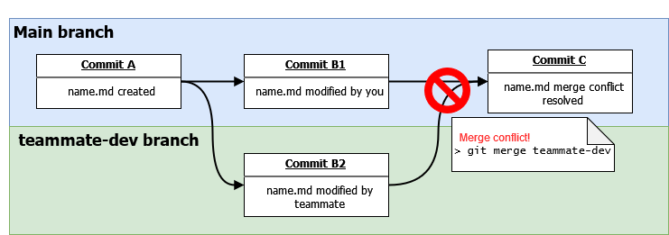

# 3081 Lab 1: Git
_(Due: Thursday, September. 14, 2023 @ 11:59pm)_

In this assignment, you will become familiar with Git and some of its standard and advanced features. You will simulate a collaborative environment where you and a team will be setting up a repository and your first step is adding your names to a name file and using Git to keep track of code changes. It is recommended that you have basic knowledge of how to use the command line in Linux. The rest of this document is divided into two parts *General Information*, and *Lab Instructions*. The *General Information* section provides instructions on the background required for this lab and how to access a lab machine to complete the assignment. (If you would like to use your own machine to complete the lab, that is ok but we may not be able to provide troubleshooting help for errors that might be machine-related. If needed, you can find how to install Git on your machine at this [link](https://git-scm.com/downloads).) The section *Lab Instructions* details the instructions for this lab.

Finally, we suggest to read this assignment by accessing this file on GitHub.


## General Information

### Background

If you are not familiar with using the command line, you can find a tutorial [here](https://ubuntu.com/tutorials/command-line-for-beginners#1-overview). (For this tutorial, you can use a lab machine; see details in the next paragraph.) In this course, we are going to use the command line extensively and we suggest you feel comfortable using it. 

## Lab Instructions

In the following sections, we use the term "REPO" to indicate the GitHub repository that we have created for you. This repo is located at https://github.umn.edu/umn-csci-3081-F23/x500-lab01 where x500 is your x500 ID. **Make sure that this is not a repository you created on your own.** Please let your Grad TA know if you do not have this repo created for you.

Please also make sure to read the whole assignment before getting started and to follow the instructions we provide to the letter (e.g., use the exact commit messages and capitalizations provided in the assignment, rather than variations of them). If you don’t know how to accomplish a task, either consult Git's help by running `git --help <command>` in a terminal, or leverage online resources (there are plenty, such as this [Git cheat sheet](https://education.github.com/git-cheat-sheet-education.pdf)). If you receive an error while executing a Git command, make sure to read the error message, as Git often suggests exactly the right thing to do.

This lab is meant for beginners to become familiar with Git and GitHub. If you feel like you are completely lost, ask your classmates, TAs, and instructors for help. You can also look at our class lecture on "Git and Version Control". In addition, you can check the tutorials at [link1](http://try.github.io/levels/1/challenges/1) and [link2](https://learngitbranching.js.org), which should further get you familiar with Git’s basic concepts. There are also plenty of helpful YouTube tutorials and articles online as well.

### Part 0 (GitHub SSH Keys)
GitHub requires users to authenticate every time they want to upload code to any repository, or download code from a private repository. You can type in your username/password every single time, but instead you will setup SSH keys to automatically authenticate your computer with GitHub's servers.

1. Generate an SSH key and add it to the SSH agent. [Follow the instructions here.](https://docs.github.com/en/authentication/connecting-to-github-with-ssh/generating-a-new-ssh-key-and-adding-it-to-the-ssh-agent#generating-a-new-ssh-key) You will need to open a terminal on your computer to run the commands in the guide. Stop after you've added your SSH key to the ssh-agent. Step 3 of Adding your SSH key to the ssh-agent is what we'll be doing next.
2. Add your key to the github.umn.edu server. [Follow the instructions here.](https://docs.github.com/en/github/authenticating-to-github/adding-a-new-ssh-key-to-your-github-account) Make sure you are adding your key to github.umn.edu, NOT github.com.


### Part 1 (Basics)
In this section, you will learn how to clone an existing repository in GitHub onto your lab machine, make a file, then upload it to GitHub.
1. Open a terminal window
2. Make a new folder for this class
    ```bash
    $ mkdir csci-3081w-F23
    ```
3. Go into this new folder (`cd csci-3081w-F23`)
    ```bash
    $ cd csci-3081w-F23
    ```
4. Next you're going to configure Git with your name and email address. Run the following commands, replacing "your name" and "x500@umn.edu" with the appropriate values: <br>
    ```bash
    $ git config --global user.name "your name"
    $ git config --global user.email "x500@umn.edu"
    ```

    (**Optional**: You can also set your default editor if you would like. For example, to set vim as the default editor, use `git config --global core.editor <editor>` where \<editor\> could be `nano`, `vim`, or `code` for vscode)

5. Now you're going to clone your REPO with the following the command.
<br>
***Note: replace x500 with your actual x500***
    ```bash
    $ git clone git@github.umn.edu:umn-csci-3081-F23/x500-lab01.git
    ```
    If this command fails, you haven't setup your SSH keys correctly. Review Part 0 to make sure you completed all the steps.

6. Now you should have a directory called `x500-lab01` (e.g., `lorim007-lab01`)
7. Go to directory `x500-lab01`
8. Modify the file `name.md` using your favorite editor and add your first and last name to the file.
9. Now, upload your changes to the `name.md` file to GitHub. To do so, first ***Add*** the changes, then ***commit*** it to your local repo with comment "Added name initials" and finally ***push*** it to your github server.<br>
    
    This command will add the `README.md` file to the commit. Alternatively, you can use `-A` tag to add all the files inside the directory.
    ```bash
    $ git add name.md
    ```

    This will commit your added files to the commit stage with the description of what you provide after the tag `-m`.
    ```bash
    $ git commit -m "Added name to name.md"
    ```

    This will finally push your committed files onto the GitHub server.
    ```bash
    $ git push
    ```
10. Now go to https://github.umn.edu/umn-csci-3081-F23/x500-lab01 (replace x500 with your actual x500) and see if your file is inside the repo.
11. Make sure you can see your `name.md` file in your repo before proceeding.

### Part 2 (Merging and Merge Conflicts)
**Scenario**: Your teammate Ash has also modified the `name.md` file with his name on another branch named `teammate-dev`.

**Your Task**: **Merge** in your teammate's changes into the `main` branch (the same branch you made and committed your changes on) without overwriting or deleting yours or your teammate's changes.


1. Locate the branch that your teammate used to submit their changes. In this case, their branch is `teammate-dev`. We can see this by using the `git branch` command with the `-r` flag to show us remote branches.
    ```bash
    $ git branch -r
    origin/HEAD -> origin/main
    origin/main
    origin/teammate-dev
    ```
2. If you want to look at your teammates changes locally (on your current machine/computer), we can switch to this branch by checking it out with `git checkout <dest_branch_name>`.
    ```bash
    $ git checkout teammate-dev
    Branch 'teammate-dev' set up to track remote branch 'teammate-dev' from 'origin'.
    Switched to a new branch 'teammate-dev'
    ```
    This has now pulled down your teammates branch, and now using `git branch` without the remote flag, we get 
    ```bash
    $ git branch
      main
    * teammate-dev
    ```
    Note that the '*' indicates what branch we are on which is currently `teammate-dev`. This command also shows what branches we have locally on our machine. You can go look at the `name.md` file now and see the changes that your teammate committed, but your changes will be missing as well. Don't worry we will solve this in the next steps.

3. Lets switch back to the **main** branch with the `git checkout` command and get started on combining the two branches. _Hint: `git checkout <dest_branch_name>`_
4. Now it's time to combine your changes. Merge in your teammate's changes using gits [merge](https://git-scm.com/docs/git-merge) command. _Don't worry, this command should fail!_
    ```bash
    $ git merge teammate-dev
    ```
5. Are you still calm? Good. What happened here is that both of these changes stemmed from the same [commit id](https://stackoverflow.com/questions/29106996/what-is-a-git-commit-id) thus causing a conflict.

6. The changes from the branch you tried to merge in (in this case, `teammate-dev`) should now be present in your branch along with your changes, and some added characters that tells you where the merge conflict is. Using an editor, open up the conflicting file and look for a region that looks something like this.
    ```
    >>>>>
    YourFirstName YourLastName
    =====
    TeammateFirstName TeammateLastName
    <<<<<
    ```
7. To resolve this issue, we want to keep both of the changes, so we can delete the added characters `>>>>>`, `<<<<<`, and `=====`. Though for future reference, say you just wanted to keep your changes and ignore your teammate's incoming changes, you can delete the symbols as well as your teammate's incoming changes.
8. Add, commit and push your changes now that the merge conflict is resolved.
    ```bash
        $ git add name.md
        $ git commit -m "Merged in teammate-dev"
        $ git push
    ```

### Final Submission

To submit your assignment, post on the Gradescope assignment "Lab 1: Git" your x500 and the commit ID of your latest commit to the main branch. Click [here](https://github.umn.edu/umn-csci-3081-f23/FAQ/blob/main/Commit%20ID/README.md) to see how to get commit id.

### Bonus Comic
[XKCD comic 1597](https://xkcd.com/1597/)

