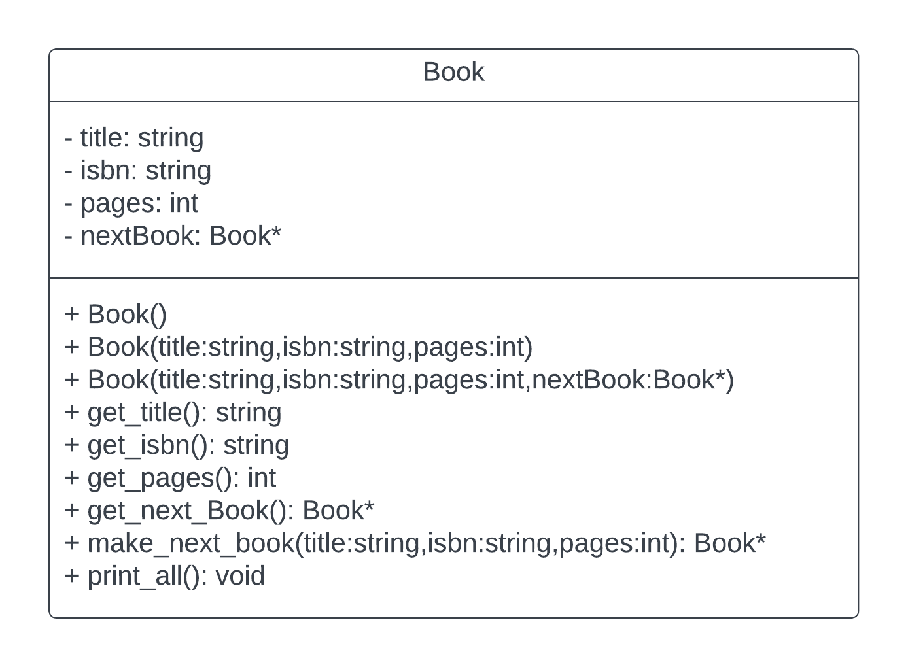

# 3081 Lab02 - Build Automation and Classes
_(Due: Thursday, September. 21, 2023 @ 11:59pm)_

## What You Will Learn

1. How to create a class
2. How to create a source and header file for a class
3. How to create a simple [makefile](https://en.wikipedia.org/wiki/Make_(software))
4. How to create a .gitignore file

## General Information

Reminder: Make sure you get checked off with a TA in your lab for attendance.

### Accessing a Lab Machine

For this assignment, we suggest you use a lab machine in ***Keller Hall 1-250*** or ***Keller Hall 1-262*** ([details](https://cse.umn.edu/cseit/classrooms-labs#cselabs)). You can also access a lab machine remotely using [SSH](https://github.umn.edu/umn-csci-3081-f23/FAQ/blob/main/SSH/README.md) or a web-based service called [VOLE](https://github.umn.edu/umn-csci-3081-f23/FAQ/blob/main/VOLE/README.md). You will use your CSE Labs account to login to the lab machines. If you do not already have an account, create the account following these [instructions](https://wwws.cs.umn.edu/account-management).


**IMPORTANT: Inside the lab machine, only files saved to your home folder (e.g., `/home/lorim007`) will persist across sessions. If you log out, make sure your progress is pushed to GitHub or saved in the home folder.**

### Diskquota Exceed
One of the reasons you might not be able to log into a lab machine is that you reached your CSE Labs Account disk quota. <br>
To free up space, [see here](https://github.umn.edu/umn-csci-3081-f23/FAQ/blob/main/CSE%20Disk%20Quota%20Exceeds/README.md)

## Retrieve Class Materials

1. Clone your personal repository for the lab. **Replace the x500 with your personal x500.**
    ```bash
    git clone git@github.umn.edu:umn-csci-3081-f23/x500-lab02.git
    ```

### What's in lab02 folder?

- main.cc
  - Contains the main function. Has a small sample program to test your class. You will not need to edit this file.

- README.md:
  - You're reading this now. _Editing this file does not change what you need to do for the lab._

## Lab Instructions

### Goals

The primary goals of this lab are for you to be able to...
 - Create a C++ class in multiple files (source and header files).
 - Create and modify a makefile to compile a simple C++ project.
 - Create and modify a .gitignore file to control file tracking in Git.

### Part 1A - Creating a Book Class
_Sometimes called a Book club_

You have recently learned about classes and structs in C++ in lecture as well as gotten a brief and informal introduction to their representations in the Unified Modeling Language (UML). In this section we will be making the source and header file for a `Book` class with the class and method definitions. Below is the UML diagram for the `Book` class. Don't worry if you don't fully understand what the diagram means yet as that is not a learning goal of today and you will more formally learn it later on in class and workshops, though as you complete this lab, it may start to make more sense.



1. Start off by creating the source and header files for the book class. These files should be of the same name (bar the file extensions .cc/.h) and lower cased. The G++ compiler that we are using supports many different file extensions for source files (cxx,cpp, and cc), though in this class we will only be using the ".cc" file extension for our C++ source files.
    ```
    book.cc
    book.h
    ```
1. In `book.h` start off by creating your header guards. These will make it so that if there is a duplicate declaration of our Book class somewhere else in our project, there will not be a duplicate or second declaration that will confuse the compiler or you, the developer.
    ```c++
    #ifndef BOOK_H_
    #define BOOK_H_
    ... code goes here ...
    #endif  // BOOK_H_
    ```

    The `#ifndef` macro is short for "If not defined" and will check to see our `BOOK_H_` header has been defined. If it has **NOT** been defined, the compiler will include the code between the `#ifndef` and its corresponding `#endif`. If the `BOOK_H_` header **has** been defined, the code within the endif mark will not be included in the compilation.

    The `#define` macro defines our `BOOK_H_` macro. So if another file is included in compilation that contains the same header guards, that file will effectively be removed from compilation.

2. Create your `Book` class with the following attributes and methods declarations.
    Book
      - Private attributes
        - title: string
        - isbn: string
        - pages: int
        - nextBook: Book* (Book pointer)
      - Public Methods and Constructors
        - Book() - "Default constructor": Think about what the default values for an uninitialized object should be. If the nextBook is of a pointer type, but not initialized, what should it point to?
        - Constructor with the following arguments
          - title: string
          - isbn: string
          - pages: int
        - Constructor with the following arguments
          - title: string
          - isbn: string
          - pages: int
          - nextBook: Book*
        - get_title(void):string
          - Returns the title of the book
        - get_isbn(void): string
          - Returns the ISBN of the book
        - get_pages(void): int
          - Returns the number of pages in the book
        - get_next_book(void): Book*
          - Returns a pointer to the next book
        - print_all(void)
          - Prints all the attributes of the book as well as the title of the next book. Should print "none" for the title of next book if `nextBook` is `nullptr`.
        - make_next_book(title:string,isbn:string,pages:int):Book*
          - Creates a _`new Book`_ with the passed in arguments on the heap and sets the current books `nextBook` attribute to the created book. Since we are returning this book, we can't create the new book on the stack, so we should make the new book using the [new](https://www.geeksforgeeks.org/new-vs-operator-new-in-cpp/#) keyword.
          - Returns a pointer to the newly created book. Don't forget to include the ';' after the closing brackets. Now might also be a good time to look back at the UML diagram and this long list. Look at the similarities and how this list translates into the UML diagram.
3. Now move over to the source file `book.cc`
4. Include the header file so that when you start filling out these function definitions, the source file knows what it is linking these definitions to.
    ```c++
    #include "book.h"
    ```

5. Now you can start filling out all function definitions. Since you are outside of the `Book` namespace, you will need to make sure that when defining the definitions you prepend the function with `Book::` to bring the function within the book namespace. For example...
    ```c++
      void Book::print_all(void){...}
    ```

## Part 2 - Makefile
Make is a powerful software tool that can automate the compilation of projects 

1. Create and open a file named `makefile`
2. The first thing we want to do is define some variables within our makefile script. For the purposes of this lab, we only need to define two variables. `CXX` and `CXXFLAGS` which are the C++ compiler that we will be using, and flags that we will be passing into the compiler.
    ```
    CXX=g++
    CXXFLAGS = -std=c++11 -g
    ```
    Here we can see we set the C++ compiler to the GNU C++ compiler which is invoked by calling g++.
    For arguments we want to pass to the compiler, we will using the c++11 standard, so we do that by setting `-std` to `c++11`. In later steps we will see where these come into play.
3. Next, we want to create a default option for make to build when we type the command `make` in the terminal. We do this by defining the `all:` ***target***.
    ```
    all: book_app
    ```
    But what did we do here? What does `book_app` mean? 'book_app' is another requirement for the `all` target that we will define in our next step. The [all target](https://www.gnu.org/software/make/manual/html_node/Standard-Targets.html#Standard-Targets) is a standard default target to compile the entire program. In this case, we are setting the requirements for the 'all target' to be the build targets for our book_app executable.
    
4. In the previous step, we used the word **target** which refers to a task that you want accomplished within the build process. This was followed with a dependency/requirement named `book_app` which says, in order for this target to complete, these files, states, or targets need to be fulfilled.

    To get a better picture of this, lets take a look at the next thing you will be adding to the makefile which is defining the `book_app:` target. ***Note: Makefiles use tabs rather than spaces for indentation***
    ```
    book_app: main.o book.o
        $(CXX) $(CXXFLAGS) main.o book.o -o book_app
    ```
    Here we have our target, `book_app` which requires the presence of two files, book.o and main.o, and when this target is invoked, it will call our `CXX` and `CXXFLAGS` command with our dependencies, then output a file called book_app. When this command is invoked, it translates to running
    ```bash
    $ g++ -std=c++11 main.o book.o -o book_app
    ```
    in the terminal.
5. But wait, in the last step we didn't have a `main.o` or `book.o` file, where do we get those? These are object files compiled by the compiler that contain the machine code for the respective C++ files. We can tell make to compile these files like we did in the last step, but with another flag. Add the following lines to your makefile and we will go through some added details below.
    ```
    main.o: main.cc
        $(CXX) $(CXXFLAGS) -c main.cc -o main.o

    book.o: book.cc book.h
        $(CXX) $(CXXFLAGS) -c book.cc -o book.o
    ```
    Once again, looking at these targets, we have the targets which are our `.o` object files which rely(depend) on the presence of their `.cc/.h` counterparts. For example, in order to make `book.o`, we **need** `book.cc`.

    What we've added in these sections though is the `-c` flag as an argument to our compiler to basically say, "Hey, don't try to make an executable with this, but turn it into an object file". This is also reflected in that we have our output file defined with the .o file extension.
6. Lastly, we can try building our project from here. At this point, in the terminal, you can invoke `make` or `make book_app` in the terminal, and you will see
    ``` bash
    $ make
    g++ -std=c++11 -c book.cc -o book.o
    g++ -std=c++11 -c main.cc -o main.o
    g++ -std=c++11 main.o book.o -o book_app
    ```
    Your output should look like the output above, and now we can run the `book_app` application.

7. ***Optional Bonus Section:*** Make is a very powerful tool that has some quality of life uses, such as cleaning up auxiliary files like object files to make clean compiles of projects easier or package up a project for a different environment.

    Here we can add a target, or "command" called clean that will help us clean up garbage files. In the following command, this will forcefully remove all files with the `.o` extension, and the `book_app` executable.
    ```
    clean:
        rm -f *.o book_app
    ```
    Then, invoking `make clean` will run this command in the terminal.

## Part 3 - Gitignore
Gross! Look at all our files right now. Maybe with the `ls` command? Just a thought. But look at all those object ".o" files. They aren't much use now that we're done with code development today, and they aren't even portable to other machines so **they should not get pushed up to github**. Should we delete them every time we're done with development? I mean I guess, but what happens if you come back to your project later, then you need to recompile which on large projects can take a long time! Our answer is `.gitignore` files. These are files that tell git "hey, don't  don't track their changes, and stage these files for commit or push.

1. Start off by creating a `.gitignore` file. Note that this is not a file extension yet rather a _hidden_ file. Files or folders that start with a period are hidden and will not show up by default in most file explorers. Remember from lab01 when setting up SSH keys and the `~/.ssh` folder was hidden?
2. Open up the `.gitignore` file in your favorite text editor and add some rules for files we want to ignore.
   ```
    *.o
    book_app
   ```

   The star in front of the ".o" is a wildcard saying any file that ends in a '.o' will be ignored. Our `book_app` entry means that our executable that we compile will not be pushed up to git as well.
3. Lastly add, commit and push this .gitignore up to github.

## Final Submission
Commit `book.h`, `book.cc`, `makefile`, and `.gitignore` to your repository. Your repo should not contain any of the object (.o) or executable files.

To submit your assignment, post on the Gradescope assignment "Lab 2: Build Automation and Classes" your x500 and the commit ID of your latest commit to the main branch. Click [here](https://github.umn.edu/umn-csci-3081-f23/FAQ/blob/main/Commit%20ID/README.md) to see how to get commit id.

