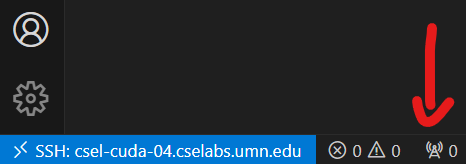
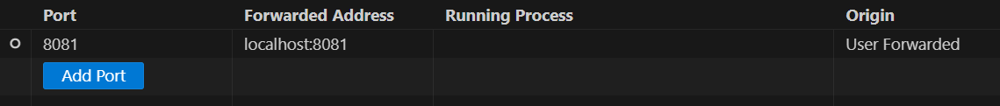
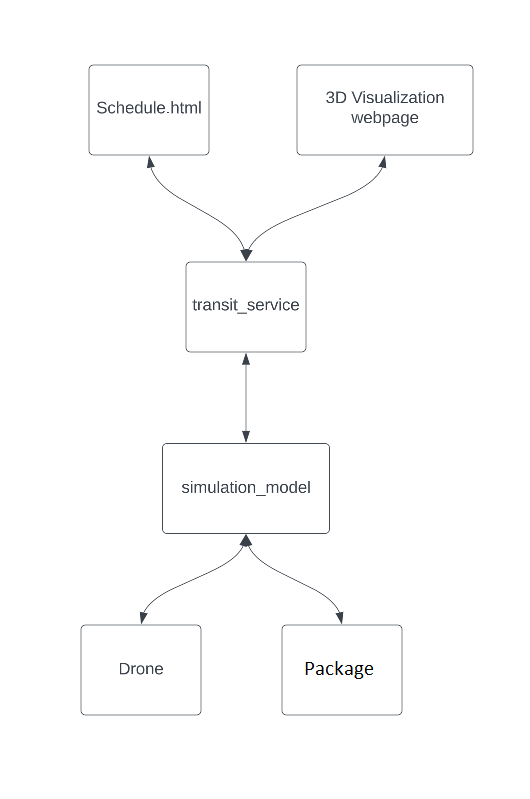
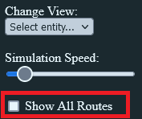

# 3081 Lab04 - Project Base code and Ethics
_(Due: Thursday, October. 5, 2023 @ 11:59pm)_

## What You Will Learn and Do

1. How to compile and run the base code for the project.
2. Data flow between the front and back
3. Add a button to the front end to stop the simulation
4. Learn about IEEE's code of ethics

## General Information

### Accessing a Lab Machine

For this assignment, we suggest you use a lab machine in ***Keller Hall 1-250*** or ***Keller Hall 1-262*** ([details](https://cse.umn.edu/cseit/classrooms-labs#cselabs)). You can also access a lab machine remotely using [SSH](https://github.umn.edu/umn-csci-3081-f23/FAQ/blob/main/SSH/README.md) or a web-based service called [VOLE](https://github.umn.edu/umn-csci-3081-f23/FAQ/blob/main/VOLE/README.md). You will use your CSE Labs account to login to the lab machines. If you do not already have an account, create the account following these [instructions](https://wwws.cs.umn.edu/account-management).


**IMPORTANT: Inside the lab machine, only files saved to your home folder (e.g., `/home/lorim007`) will persist across sessions. If you log out, make sure your progress is pushed to GitHub or saved in the home folder.**

### Diskquota Exceed
One of the reasons you might not be able to log into a lab machine is that you reached your CSE Labs Account disk quota. <br>
To free up space, [see here](https://github.umn.edu/umn-csci-3081-f23/FAQ/blob/main/CSE%20Disk%20Quota%20Exceeds/README.md)

## Lab Instructions

### Retrieve Class Materials

1. Clone your personal repository for the lab. **Replace the x500 with your personal x500.**
    ```bash
    git clone git@github.umn.edu:umn-csci-3081-f23/x500-lab04.git
    ```
### What's in lab04 folder?

<ul>
  <li>  <code>README.md</code>
  <li>  <code>.gitignore</code>
  <li>  <code>app</code> folder, which contains:
    <ul>
      <li>  <code>graph_viewer</code> : producing graph visualization
      <li>  <code>transit_service</code> : visualization
    </ul>
  <li>  <code>libs</code> folder, which contains:
    <ul>
      <li>  <code>routing</code> : finding the paths
      <li>  <code>transit</code> : entities properties
    </ul>
  <li>  <code>dependencies</code> : Libraries & library header files. 
</ul>

At the end of this lab, you will be able to compile and run the simulation. You will be able to set the pickup location and the final destination of the packages. And lastly, you will be able to add simple elements on the front to interact with our backend C++ code.

This directory contains the support code needed to visualize the drone simulation system, and in this lab, we will be adding functionality to stop the simulation if the user clicks a “Stop” button on the front end web page.

### Design Choices ##
We would like you to start getting into the mindset of a developer making software for a customer. Doing so may help you navigate this class and understand what is being asked of you, the developer/student, in this pseudo work environment. Remember, all work places are different. Because of this, we can only get close to what you may experience after graduation, but not exactly what it will be like.

In software development, instances arise when customers fail to provide specific instructions or requirements. This leaves developers with the responsibility of making design choices. However, there are situations where developers might feel uneasy or uncertain about assuming this decision-making role. In such cases, it is crucial for developers to promptly revert to the customer, or in an educational environment, seek guidance from teaching assistants or the instructors. This ensures that the final product aligns closely with the customer's expectations and helps developers avoid potential missteps or misunderstandings.

### Note ###
This lab deals with modifying front end code. This is an anomaly from what you will be working on [back end C++ code] for a large majority of the semester. Please remember this for future labs that features will **NOT** be primarily made through the front end.

### Getting Started

Here is a quick overview of how to run the visualization (If you are using ssh, navigate to ssh category below):

  ```bash
    # Go to the project directory
    cd /path/to/repo/project
    
    # Build the project
    make -j
    
    # Run the project (./build/web-app <port> <web folder>)
    ./build/bin/transit_service 8081 apps/transit_service/web/
  ```

In a web browser, navigate to http://127.0.0.1:8081 and you should see a visualization.
_Note: You may not be able to bind to the port. If you started the transit_service with a different port, you will need to change the link to that port._

Navigate to http://127.0.0.1:8081/schedule.html and you should see a page to schedule the delivery.

*Note: 8081 will depend on what port you used. If you use port 8082, then it will be http://127.0.0.1:8082 instead.*


# Build and run in different environments

## Getting Started using SSH into CSE Lab machines

**Important: You have to start the ssh clean if you would like to use the commands below. This means, if you are currently using vscode and already login via ssh, then you cannot run the commands below.**

1. SSH into a CSE Lab Machine using **port forwarding** for the UI

   **Note:** If port `8081` is not available, choose a different port (e.g. 8082, 8083, etc...)

    ```bash
    ssh -L 8081:127.0.0.1:8081 x500@csel-xxxx.cselabs.umn.edu
    ```
    
    Example:
    ```bash
    ssh -L 8081:127.0.0.1:8081 lorim007@csel-kh1250-05.cselabs.umn.edu
    ```

2. Compile the project (within ssh session)

    ```bash
    cd /path/to/repo/project
    make -j
    ```
    
 3. Run project (within ssh session)

    ```bash
    ./build/bin/transit_service 8081 apps/transit_service/web/
    ```

5. Navigate to http://127.0.0.1:8081 and you should see a visualization.

6. Navigate to http://127.0.0.1:8081/schedule.html and you should see a page to schedule the delivery.

7. To stop the simulation, go to the terminal that you are running the simulation on and hit CTRL+C.

## SSH Through VS-Code
If you are using Visual Studio Code on your personal machine and SSH'd into a school machine to run the project, you can set up visual studio code to port forward for you!

1. Once connected through VScode-SSH, look for a radio tower logo at the bottom of the application and click it.

2. This will bring up a sub-window with a box saying "Forward a port". Click on the box.
3. In the column that says **Port**, add an entry for whatever port you would like to forward to your local machine. Once submitted, you should see something like this.

4. You should now be good to navigate to `http://127.0.0.1:forwardedPortNumber` in your browser (If you have the project up and running) and see the drone simulation!

## Using VOLE

1. See [here](https://github.umn.edu/umn-csci-3081-S23/FAQs/tree/main/VOLE) on how to start using VOLE.


2. Compile the project within a terminal

    ```bash
    cd /path/to/repo/project
    make -j
    ```
    
  3. Run project

      ```bash
      ./build/bin/transit_service 8081 apps/transit_service/web/
      ```

  4. Navigate to http://127.0.0.1:8081 in a web browser and you should see a visualization.

  5. Navigate to http://127.0.0.1:8081/schedule.html and you should see a page to schedule the delivery.

  6. To stop the simulation, go to the terminal that you are running the simulation on and hit CTRL+C.


### Localhost (127.0.0.1) and Ports ###

Though outside the scope of what we will be learning in this class, having a slight understanding of localhost and ports will be helpful as these terms will be commonly used when working on this project. Here, we will slightly go over a quick explanation of ports and localhost to help you understand some of the unexplained steps that we just went over.

  Within a network, computers have addresses most notably known as [IP addresses](https://en.wikipedia.org/wiki/IP_address) which help identify and route traffic within a network. Within a network, a computer may have an address of something like 192.168.1.100 which can be used to address that computer, but if the computer wants to address itself, it can use the localhost address which is `127.0.0.1`. This is the computer's way of saying "Me". We can also *sometimes* use the `localhost` name which will resolve back to `127.0.0.1` within the machine. You can try this. While having the simulation running, use both
 
  - https://localhost:8081
  - https://127.0.0.1:8081

  And you will be taken to the same page.

  **Ports** in a computer are "gateways" and tools that processes use to send and receive data to another computer or endpoint. By default, web browsers use port 80 or 8080 to send and receive data, though are not limited to just those two ports. Since those ports are commonly used and we can only bind one process to a port at a time we are forced to use other ports such as 8081 or 8082. This also explains why sometimes you may encounter the error when starting your server in a SSH session where you can't bind to your desired port, this may just mean another student is using the same machine and that port. Either change machines or try a completely different port.

  Both of these topics should be introduced and covered in CSCI4061 where you will go more in depth than what was briefly discussed here. To avoid getting off track, this section is kept brief, though hopefully informative enough to give you more insight into what is going on in the full extent of this code.


# Simulation

## Schedule
You will be able to schedule packages for delivery in this page http://127.0.0.1:8081/schedule.html. 

Type passenger name, select start and end destination, and press `Schedule Delivery` button to schedule a delivery. 

Now go to the 3D Visualization page and select the view of the entities on the top right corner.

## 3D Visualization
You will be able to watch the simulation of the drone and the package here http://127.0.0.1:8081.

On the top right corner, you can change your camera view into locking the entities.

## Data Flow

A simple block diagram overview of the data flow in this program can be seen here.



## Creating a Stop Button ##

Stopping a simulation by going to the terminal and mashing CTRL+C feels a little... barbaric... for our clients. Our task in this section is to add a "Stop Simulation" button to our frontend \[Webpage\] piece of our software, and have it carefully stop the software in the backend C++.

### Modifying the front end Webpage ###
Like previously mentioned in the note, this class is taught in C++, though sometimes you may need or want to get your elbows dirty in other languages to add features to the simulation. This is one of those situations, but we will help walk you through this relatively simple process.

  1. Open the document `apps/transit_service/web/index.html` and scroll down till you find a line that contains...
      ```html
      <br><input type="checkbox" onclick='toggleRoutes()'> Show All Routes
      ```
    
      This line is the element [technically 2 with a break element] that has the "radio button" to toggle showing the grid that the drones can travel on.

      

  2. Now to add our own button. Copy and paste this line below the line mentioned in step 1.

      ```html
      <br><button onclick='stopSimulation()'>Stop Simulation</button>
      ```
  
      For those that are curious, here is what we've added and a brief overview of what each part of this line does.

        - `<br>` break line to make the button on the following line to the show all routes radio button
        - `button` defines what kind of html element we are creating
        - `onclick='stopSimulation()'` defines what function to be called when this button is clicked. We will define this `stopSimulation` function very soon.
        - Lastly, `>Stop Simulation<` is the text that will show up in the button

  3. Now it's time to modify the Javascript code. Open `apps/transit_service/web/js/main.js` and add the following function anywhere in the file. 
      ```js
      function stopSimulation()
      {
        api.sendCommand("stopSimulation",{test:"test"});
      }
      ```

        This is the function that we said we would fulfill earlier in our button callback `onclick` function. All this function does is send back a command, in this case "stopSimulation" with a JSON payload key-value pair. After this, we are now done with modifying the front end.
### Modifying the Backend (C++) ###
At this point, our front end is sending data/commands to our backend C++ server, though we are not handling this data. There are a few places we can start this process, but let's start with immediately seeing where the data comes in.

1. Open `apps/transit_service/src/transit_service.cc` and modify the `void ReceiveCommand(...)` so there is an else case that handles if the command is "stopSimulation". Look at the other if-else cases for a hint.
**Right now we just want you to make an empty `else-if` statement, we will revisit this section and add logic here**
2. Let’s look at the logic of how this simulation is being run. Within the same file, find the main function. You will find this logic
    ```c++
    while (true) {
        server.service();
    }
    ```

    Run our server's service forever until we manually stop it, or some error happens. How should we attack this so that we can gracefully stop the server?

    You might have some great ideas which would be great to explore, though for the sake of this lab, we are going to have a `boolean` flag within the server that says whether or not the server is "alive". Let's change this literal `true` value so that it does just that. Change `true` to `server.isAlive()`. We will define the `isAlive()` and another function later on. **If you try to compile right now, it will fail**.
3. Hold on for a minute as the next few steps start to go down a rabbit hole of function class and jumping between two classes.

    Remember back to step 1 of the backend code where we modified `TransitService::ReceiveCommand(...)`, but what does this class know/have access to? Well looking at some of its members, we can see that it has an attribute `model` which is of type `SimulationModel&` where the "&" just means that its a **reference** to a SimulationModel object. Let's go take a look at the `SimulationModel` class and see what we can do from there.

    Open `libs/transit/include/SimulationModel.h`, and see that SimulationModel has a `controller` attribute which in this case is our `TransitWebServer` which is a child class of `IController`.

    In the header file, add a declaration for a "stop" function. All this function will do is pass through a stop command to the controller object within SimulationModel.

     `libs/transit/include/SimulationModel.h`:
    ```c++
    void stop(void);
    ```

    And in the definition source file, `libs/transit/src/SimulationModel.cc`, define the function as follows.
    ```c++
    void SimulationModel::stop(void) {
      controller.stop();
    }
    ```
    As of now, controller may not have a definition or a stop function defined, we will solve this in the next step.

4. Okay, we now see the path from our receive command function to our TransitWebServer class so that we could modify that `boolean alive` flag that was mentioned earlier. Since we want to keep our program open to extension, and SimulationModel::controller is an `IController` class, we need modify the `IController` class by creating two purely virtual functions.

    In `libs/transit/include/IController.h`, add these two functions in the public section.

    ```c++
    /// Sets alive flag to false to stop the simulation
    virtual void stop(void) = 0;
    /// Returns boolean value if simulation is alive
    virtual bool isAlive(void) = 0;
    ```

      The functions are virtual because we want them to be overloaded by their inherited classes, and then they are set to 0 [` = 0;`] to make them purely virtual, forcing all inherited classes to declare a definition for the functions. Even if those function’s definitions are empty "`{}`".

5. Eyes rolled back in your head yet? Don't forget to blink once in a while. Almost to the finish.

    In the last step, we declared two purely virtual functions, `stop()` and `isAlive()` for the IController base class. There are two classes that inherit from the IController class, `TransitWebServer` and `TransitService` meaning that we have to now create declarations for the two functions defined in the previous step for **each** of the two previously mentioned classes.

    Taking care of `TransitService` in `apps/transit_service/src/transit_service.cc` first, because this class has no immediate use of these functions, we can define them to be empty or satisfy the minimal requirement to make the compiler happy. Within `TransitService`'s scope, add the following code
    ```c++
    void stop(void) {}

    bool isAlive(void){ return true; }
    ```

    For `TransitWebServer`, we are finally going to add that *boolean flag* that was previously mentioned. **Add a private boolean member named `alive`**, then add the following lines of code to modify that attribute.
    ```c++
    void stop(void) { alive = false; }

    bool isAlive(void) { return alive; }
    ```
    "But wait! When does `alive` ever get set to true? Wouldn't the simulation just stop right away?" you ask. Great question. We should have alive get set in the constructor of the `TransitWebServer` class. Modify the constructor so that `alive = true`.

6. Would you believe me if I told you this was the final step? Regardless of what you said, it is. So we have almost everything going, but we still have that empty *else-if* statement in our `ReceiveCommand` method. Let's finally patch that up.

    Head to `apps/transit_service/src/transit_service.cc` where you made your handler *else-if* section. You've set up all the pieces now, and now it's time to add `model.stop()`.

    After this, you should be able to compile and run your simulation, hit the stop button that you've added, and the simulation will more _~gracefully~_ stop.

## Reminder ##
This lab deals with modifying front end code. This is an anomaly from what you will be working on [back end C++ code] for a large majority of the semester. Please remember this for future labs that features will **NOT** be primarily made through the front end.

## IEEE Code of Ethics for Software Engineers ##
Alone, or with a friend, take the gradescope quiz "Lab04 - Ethics Quiz". You can take this quiz as many times as you would like until the due date. Note that if you work and discuss with a partner, you both still have to complete the quiz for each of you to receive credit. The link below will help you complete the quiz.
 
[IEEE Code of Ethics for Software Engineers](https://www.computer.org/education/code-of-ethics)

## Submission ##

- (60%) Push all of your code changes to your github repository. 
- (40%) Complete the gradescope Quiz on IEEE Code of Ethics for Software Engineers
  - [Sections 001/883](https://www.gradescope.com/courses/565751/assignments/3227995)
  - [Sections 010/020](https://www.gradescope.com/courses/600308/assignments/3435780)

Then post on the Gradescope assignment for lab04, your x500 and the commit ID for your submission.
[Click here](https://github.umn.edu/umn-csci-3081-f23/FAQ/blob/main/Commit%20ID/README.md) to see how to obtain commit ID.
